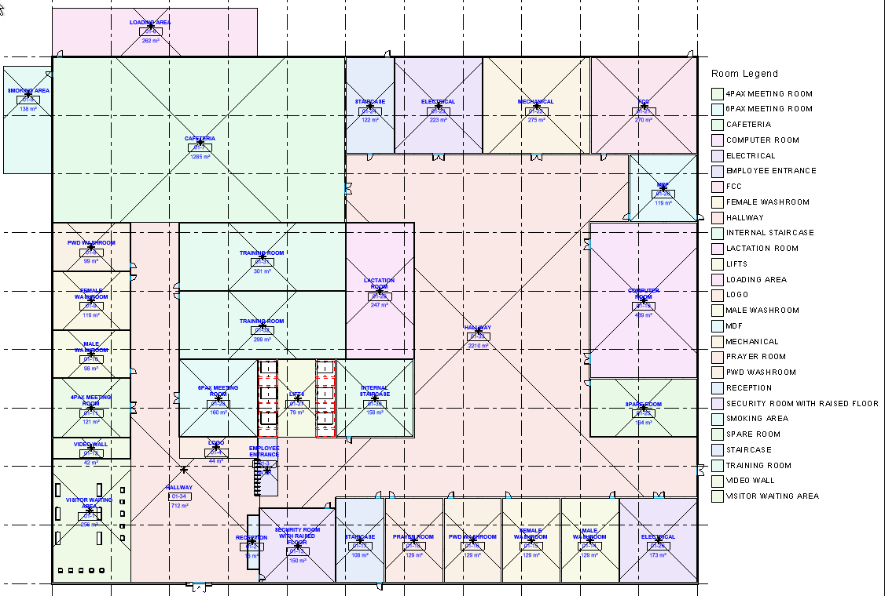

Hackathon : 

## Generative AI World Cup 2024: So you think you can hack

Challenge : https://hackathon.stackup.dev/web/events/generative-ai-world-cup-2024-so-you-think-you-can-hack

## Solution 

Graph Room Prediction using Graph

The layout for each building level adheres to fixed boundaries, allowing for some flexibility in room placement. While certain areas, such as restrooms, stairwells, and corridors, are fixed in position, all other rooms can be adjusted horizontally within the designated space. Rooms may expand into adjacent areas if necessary; however, vertical adjustments are not permitted. Clients may have specific preferences for room adjacency, which will be taken into consideration during the design process. The following seven disciplines are represented:

## Data

- grid_line.json - [grid_line.json](./data/grid_line.json)
- related_doors.json - [related_doors.json](./data/related_doors.json)
- room.json - [room.json](./data/room_relationship.json)

## How to run ?

- Clone the project
- Open Revit Software and demo model
- Build the project and use [Revit Add-in Manager](https://github.com/chuongmep/RevitAddInManager) to run command :
  - [ExportGridCommand](../RoomGraph/RoomGraph/ExportGridCommand.cs) : Export Grid Line to JSON file
  - [ExportRoomRelationCommand](../RoomGraph/RoomGraph/ExportRoomRelationCommand.cs) : Export Room Relationship to JSON file
  - [ExportDoorRelateCommand](../RoomGraph/RoomGraph/ExportDoorRelateCommand.cs): Export Door Relation to JSON file

## Q&A

- Why C# not Python ? 
C# is often preferred over Python for Revit development because it offers more power and flexibility. Its tighter integration with Revit's API and better performance in handling complex operations makes it a more efficient choice for large-scale or performance-sensitive projects.

- Why we need to export Door Relation ?
The door relation is important for the room relationship. The door is the main entrance to the room and the room relationship is based on the door relationship.

## Limitation

- The project demo just tested with Revit 2022.2, the project may be need to update for the latest version of Revit.

## Resources 

- [Revit API](https://www.revitapidocs.com/)
- [Revit Add-in Manager](https://github.com/chuongmep/RevitAddInManager)
- [https://hub.stackup.dev/](https://hub.stackup.dev/)